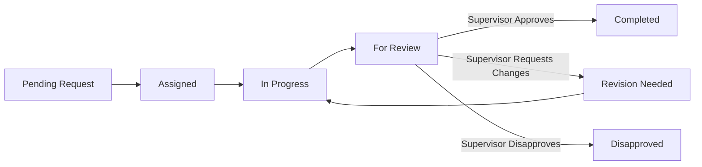

# Marketing Operations Portal 🚀
## User Manual & Site Feature Guide

Welcome to the **Marketing Operations Portal** ("Marketing Portal"), a modern, full-featured task management, analytics, and workflow review application designed specifically for company marketing operations.

This manual serves as both a **System Feature Guide** and a **Role-Based User Manual**, detailing all application features and distinguishing between **Supervisor Mode** and **Member Mode**.

---

## 📌 1. System Overview & Architecture

The Marketing Portal is built to streamline task creation, workload tracking, review approvals, and analytics within department teams.

- **Role-Based Access Control (RBAC)**: Users are authenticated via Supabase Auth and assigned to a **Department** with one of two primary system roles:
  - **Member (`marketing_member`)**: Scoped to executing assigned work, tracking task progress, posting comments, and submitting deliverables for review.
  - **Supervisor (`marketing_supervisor`)**: Scoped to managing department operations, creating and assigning tasks, executing review approvals/revisions, accessing team analytics, and managing admin configurations.
- **Row Level Security (RLS)**: Enforced directly at the database layer. Members see their own tasks and department summaries, while Supervisors have full access to view, update, and manage all department tasks and staff accounts.
- **Interface & Layout**: Features a persistent dark navy sidebar (`#0f1a3c`), dark/light mode toggle, mobile-responsive layout drawer, and notification alerts.

---

## ⚡ 2. Feature Matrix: Supervisor Mode vs. Member Mode

The table below summarizes the access rights and operational capabilities available in each mode across the site:

| Page / Feature | Member Mode | Supervisor Mode | Description |
| :--- | :---: | :---: | :--- |
| **Home — Marketing Overview** | ✅ View Only | ✅ Full Access | View Capacity & Risk summary cards, team workload grid, and Next Due Task panels. |
| **Export CSV (Tasks Data)** | ✅ Allowed | ✅ Allowed | Download full CSV report of marketing tasks. |
| **+ Create New Task** | ❌ Hidden | ✅ Allowed | Launch task creation modal to assign work across team members. |
| **Supervisor Focus Panel** | ✅ View Only | ✅ Full Access | Displays dynamic operational indicators (*Highest Workload*, *Most Overdue*, *Most Review Pressure*). |
| **Task Management — List View** | ✅ View / Edit Assigned | ✅ Full Access | Browse tasks organized into 7 collapsible stage sections. |
| **Task Management — Kanban View** | ✅ Drag/Drop Assigned | ✅ Drag/Drop All | Visual column board for drag-and-drop status updates. |
| **Task Management — Calendar View** | ✅ View Tasks | ✅ View Tasks | Month grid display showing due dates for all tasks. |
| **Task Detail Modal & Comments** | ✅ View & Comment | ✅ View, Edit, Delete, Comment | Open full task details, update status, view audit logs, and post comments. |
| **Delete Task** | ❌ Hidden | ✅ Allowed | Permanently remove a task from the system. |
| **Review Panel — View Queue** | ✅ View Own Submissions | ✅ View All Department Reviews | Dedicated panel for tasks in `For Review` status. |
| **Review Panel — Approve Action** | ❌ Hidden | ✅ Allowed | Instantly approve deliverables and transition status to `Completed`. |
| **Review Panel — Hold for Revision** | ❌ Hidden | ✅ Allowed | Send back with custom revision notes and increment revision counter. |
| **Review Panel — Disapprove Action** | ❌ Hidden | ✅ Allowed | Reject task request with mandatory disapproval reason. |
| **Team Stats — Analytics Dashboard** | ✅ View Charts | ✅ View Charts | Performance metrics, workload distributions, department pie chart, and completion rates. |
| **Export Full Report CSV** | ✅ Allowed | ✅ Allowed | Export complete team workload & analytics breakdown in CSV format. |
| **Admin Center — Team Roster (CRUD)** | ❌ Hidden | ✅ Allowed | Add, edit roles/departments, and delete team member profiles. |
| **Admin Center — Templates (CRUD)** | ❌ Hidden | ✅ Allowed | Create and delete structured request templates. |
| **Admin Center — System Credentials** | ❌ Hidden | ✅ Allowed | Bulk initialize standard staff authentication credentials. |
| **Admin Center — Reset Task Data** | ❌ Hidden | ✅ Allowed | Destructive system operation requiring text confirmation (`RESET`). |
| **My Account — Profile & Avatar Upload** | ✅ Allowed | ✅ Allowed | Upload custom profile photo (up to 2MB), update display name. |
| **My Account — Security & Password** | ✅ Allowed | ✅ Allowed | Update password with real-time strength & match validation. |
| **My Account — Notifications Prefs** | ✅ Allowed | ✅ Allowed | Toggle email/app notification switches. |
| **My Account — Team Roster Directory** | ✅ Allowed | ✅ Allowed | View directory of team members and active company departments. |

---

## 🏠 3. Feature Breakdown by Page

### 3.1 Home — Marketing Overview
The central dashboard providing real-time visibility into overall capacity, pending risks, and individual workloads.

- **Capacity & Risk Cards**:
  1. **Active Workload**: Count of tasks currently assigned, in progress, or under review.
  2. **Due This Week**: Total tasks due in the active calendar week.
  3. **Overdue**: Highlighted count (in red) of open tasks past their due date.
  4. **Review Bottlenecks**: Tasks waiting for supervisor approval or revision.
- **Team Workload Grid**: Individual cards for each team member displaying:
  - Avatar initials or photo.
  - Active task count and tasks due this week.
  - Overdue count, Review Bottleneck count, and Average Revision count.
  - Color-coded status pills (**Assigned**, **In Progress**, **Review**, **Revisions**).
  - **Next Due Task** preview window.
- **Team Bottlenecks & Supervisor Focus Panel**:
  - Summary metrics for *For Review*, *Revision Needed*, and *Unassigned Active*.
  - **Supervisor Focus** callout box computing team members with the highest workload, most overdue items, and highest review pressure.

---

### 3.2 Task Management (`/tasks`)
The primary workflow hub supporting three interactive views (**List**, **Kanban**, and **Calendar**).

- **Multi-View Switcher**:
  - **List View**: Organizes tasks into 7 collapsible stage sections with stage count badges:
    1. ⚪ *Pending Requests*
    2. 🔵 *Assigned Tasks*
    3. 🟡 *In Progress*
    4. 🟣 *For Review*
    5. 🔴 *Revision Needed*
    6. 🟢 *Completed*
    7. 🌹 *Disapproved*
  - **Kanban View**: Interactive column board allowing cards to be dragged and dropped into new statuses.
  - **Calendar View**: Visual calendar plotting tasks on their assigned due dates.
- **Search & Filtering**:
  - Global search bar filtering across Task Code (`MR-XXXX`), Title, Requestor, Assignee, and Description.
  - Status pill filter buttons (**All**, **Pending**, **Assigned**, **In Progress**, **For Review**, **Revision**, **Completed**, **Disapproved**).
- **Task Detail & Edit Modal**:
  - Accessible by clicking any task card.
  - View full task specifications, priority tags (`LOW`, `NORMAL`, `HIGH`, `URGENT`), requestor details, assignee, due date, and creation timestamp.
  - **Audit Activity Log**: Displays chronological log of task status changes and actions.
  - **Real-Time Comment Thread**: Interactive chat thread allowing team members to communicate, ask questions, or attach feedback directly on the task.

---

### 3.3 Review Panel (`/review`)
Dedicated review queue for all tasks submitted under `For Review` status.

- **Empty State**: When no tasks are awaiting review, displays a clean green checkmark confirmation (*"Everything is up to date"*).
- **Review Queue Item**:
  - Displays Task Code, Title, Time Submitted, Requestor, Assignee, and current Revision Count.
  - Full task description and submission details.
- **Supervisor Review Actions**:
  - 🟢 **Approve Task**: Updates status to `Completed`, records activity log, and notifies assignee/requestor.
  - 🟡 **Hold for Revision**: Opens feedback modal requiring the supervisor to enter detailed revision notes. Increments `revision_count`, updates status to `Revision Needed`, posts feedback to comment thread, and sends notification.
  - 🔴 **Disapprove Task**: Opens modal requiring a disapproval reason. Updates status to `Disapproved` and sends notification.
- **Member View**: Members can view their submitted tasks pending supervisor review, marked with a *"Pending Supervisor Review"* status pill.

---

### 3.4 Team Stats — Analytics Overview (`/stats`)
Dynamic metrics dashboard powered by interactive Recharts visual components.

- **Top Summary Metrics**:
  - **Total Requests**: Overall volume of marketing tasks created.
  - **Completed**: Total successfully finished projects.
  - **In Progress**: Active ongoing tasks.
  - **Overdue**: Open tasks exceeding deadlines.
- **Interactive Analytics Charts**:
  1. **Avg. Revisions per Project**: Bar chart evaluating quality/re-work frequency per team member.
  2. **Active Tasks per Member (Workload)**: Vertical bar chart depicting current active workload balance.
  3. **Requests by Department**: Donut/Pie chart depicting demand volume coming from different departments (e.g., Marketing, Accounting, Corporate, HR, Operations).
  4. **Completed Projects by Member**: Horizontal bar chart tracking team output and completed projects.
- **Export Full Report**: One-click export downloading a formatted CSV file summarizing all metrics and member performance.

---

### 3.5 Admin Center (`/admin`) — *Supervisor Mode Only*
Exclusive administration console for supervisors to manage users, templates, and system data.

- **Tab 1: Team Member Roster (CRUD)**:
  - Table displaying Member Name, Email, Avatar, Role (`Supervisor` / `Member`), and Department.
  - **Add Team Member**: Modal form to add a new user to the roster.
  - **Edit Member**: Update member's display name, assigned role, or department.
  - **Delete Member**: Permanently remove a team member from the system roster.
- **Tab 2: Request Templates (CRUD)**:
  - Structured templates used to pre-populate task creation fields (e.g., *Brand Design Request*, *Social Media Campaign*).
  - **Create Template**: Modal to define template name and default key-value fields.
  - **Delete Template**: Remove outdated templates.
- **Tab 3: System & Danger Zone**:
  - **Initialize Team Credentials**: One-click utility to bulk initialize standard login accounts for staff members.
  - **Reset All Task Data**: Destructive admin action that clears all marketing requests, comments, activity logs, and notifications from the database while keeping user login credentials intact. Requires text confirmation (`RESET`).

---

### 3.6 My Account (`/account`)
Personal profile management and system settings hub for all users.

- **Profile Overview & Avatar Upload**:
  - View current display name, email, role badge, and department tag.
  - **Avatar Upload**: Interactive hover overlay allowing users to upload a custom profile image (PNG, JPEG, WebP up to 2MB).
- **Change Display Name**: Form to update system display name across the portal.
- **Change Password**: Security section with live validation indicators:
  - Checkmark for *At least 8 characters*.
  - Checkmark for *Passwords must match*.
- **Notification Preferences**: Toggle switches for key events:
  - *Notify me when a comment is posted on my request*
  - *Notify me when my request status changes*
  - *Notify me when a task is assigned to me*
  - *Weekly digest of team activity*
- **Marketing Roster & Department Directory**:
  - Scrollable list of all active Marketing team members with role badges.
  - Active list of company departments.

---

## 🔄 4. Task Lifecycle & Status Workflow

Every task in the Marketing Portal moves through a defined lifecycle.

### Status Descriptions:
1. `pending`: Initial request submitted, awaiting assignment.
2. `assigned`: Task assigned to a specific marketing team member.
3. `in_progress`: Assignee is actively working on deliverables.
4. `for_review`: Deliverables completed and submitted for supervisor review.
5. `revision`: Supervisor requested changes; task sent back to assignee.
6. `completed`: Supervisor approved deliverables; task finished.
7. `disapproved`: Supervisor rejected task request.

---

## 📖 5. Step-by-Step User Guides

### 5.1 Member Mode User Guide
1. **Logging In**: Access the login page (`/login`) with your company email and password.
2. **Checking Workload**: Navigate to **Home** to view your active tasks, due dates, and supervisor notifications.
3. **Updating Task Progress**:
   - Go to **Task Management** (`/tasks`).
   - Click on your task card or drag it in **Kanban View** from `Assigned` to `In Progress`.
   - Use the **Comment Thread** inside the Task Detail modal to ask questions or share progress updates.
4. **Submitting for Review**:
   - Once work is complete, change the task status to `For Review`.
   - Your task will now appear in the **Review Panel** awaiting supervisor approval.
5. **Handling Revision Requests**:
   - If a supervisor holds your task for revision, you will receive a notification and the task status will change to `Revision Needed`.
   - Open the task comment thread to read the supervisor's feedback notes, make requested edits, and re-submit to `For Review`.

---

### 5.2 Supervisor Mode User Guide
1. **Creating & Assigning Tasks**:
   - Click **+ Create New Task** from the Home or Tasks header.
   - Enter title, description, priority (`LOW`, `NORMAL`, `HIGH`, `URGENT`), assign to a team member, set a due date, and select an optional request template.
2. **Monitoring Bottlenecks**:
   - Review the **Supervisor Focus** card on the Home page to identify team members experiencing high workload, overdue tasks, or review pressure.
3. **Reviewing Deliverables**:
   - Open the **Review Panel** (`/review`).
   - Review submitted tasks in `For Review` status.
   - Click **Approve Task** to finalize, **Hold for Revision** to specify required edits, or **Disapprove** to reject.
4. **Managing System Administration**:
   - Open **Admin Center** (`/admin`) to add/edit team member accounts, configure request templates, or perform system maintenance.

---

## ❓ 6. FAQs & Troubleshooting

- **Q: Why don't I see the Admin Center tab in my sidebar?**
  - *A*: The Admin Center is restricted to users with `role = 'supervisor'`. Member accounts will not see or have access to this page.
- **Q: What is the maximum file size for profile photo upload?**
  - *A*: Images must be under 2MB in PNG, JPEG, or WebP format.
- **Q: How do I switch to Dark Mode?**
  - *A*: Click the **Dark Mode** toggle switch at the bottom of the left sidebar. Your preference will automatically persist across browser sessions.
- **Q: Can Members delete tasks?**
  - *A*: No. Task deletion is strictly restricted to Supervisors to maintain audit trails.
